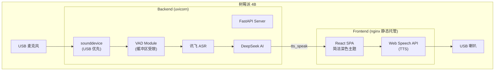

# Design Document: raspi-optimization

## Overview

本设计文档描述智能镜面语音助手项目针对树莓派 4B（ARM64, 1-4GB RAM）的优化方案。优化分为三大模块：

1. **前端 UI 简化**：移除粒子系统、扫描线、HUD 装饰、霓虹发光等 GPU 密集效果，改为简洁深色主题
2. **后端精简与 TTS 迁移**：移除 zhipuai/pyttsx3 依赖，TTS 改为通过 WebSocket 通知浏览器端 Web Speech API 执行
3. **Linux 音频兼容与内存优化**：USB 音频设备优先选择、VAD 缓冲区限制、整体内存控制

目标：在树莓派有限资源下通过 `pip install` + `npm build` + `uvicorn` 直接运行，实现流畅体验。

## Architecture



### 部署方式变更

移除 Docker 部署，改为直接运行：
- 后端：`pip install -r requirements.txt` + `uvicorn app.main:app --host 0.0.0.0 --port 8002`
- 前端：`npm run build` → nginx 托管 `dist/`
- 系统依赖：`apt install libportaudio2`

## Components and Interfaces

### 1. 前端组件变更

| 组件 | 变更 |
|------|------|
| `App.jsx` | 移除 `bg-particles` div 及其 40 个 span 子元素，移除 `bg-grid` |
| `ScreenSaver.jsx` | 移除 `scanline` div、4 个 `hud-corner` div |
| `AIChatPopup.jsx` | 移除 `ai-particles` div 及其 18 个 span 子元素 |
| `WebSocketService.js` | 新增 `tts_speak` 消息处理，调用 `speechSynthesis` |

### 2. 前端样式变更

| 文件 | 变更 |
|------|------|
| `sci-fi-theme.css` | 移除 `.neon-text` 多层 text-shadow、`.glass` box-shadow glow、`.hud-corner`、`.scanline` 样式；保留深色背景色方案，改用高对比度纯色文字 |
| `animations.css` | 移除 `rise`、`floatUp`、`scan`、`pulse` keyframes 及 `.bg-particles`、`.ai-particles` 样式；保留 `blink`（时钟冒号）和 `dot`（思考指示器） |

### 3. 后端 TTS 接口变更

**旧方案**：`CommandExecutor.tts()` → `pyttsx3.init()` → 本地音频输出

**新方案**：
```python
async def tts(self, text: str) -> None:
    """通过 WebSocket 通知前端使用 Web Speech API 朗读。"""
    from .websocket_server import manager
    from .asr_handler import asr_handler
    # 闭麦防回声
    estimated_seconds = max(len(text) * 0.3, 3.0)
    asr_handler.mute_for(estimated_seconds + 2.0)
    asr_handler.mark_tts_output(text, estimated_seconds + 5.0)
    await manager.broadcast({"type": "tts_speak", "text": text})
```

**前端 TTS 处理**（在 WebSocketService 或 App 层）：
```javascript
wsService.on('tts_speak', (data) => {
  if (!window.speechSynthesis) {
    console.warn('[TTS] Web Speech API not supported');
    return;
  }
  const utterance = new SpeechSynthesisUtterance(data.text);
  utterance.lang = 'zh-CN';
  // 优先选择中文语音
  const voices = speechSynthesis.getVoices();
  const zhVoice = voices.find(v => v.lang.startsWith('zh'));
  if (zhVoice) utterance.voice = zhVoice;
  speechSynthesis.speak(utterance);
});
```

### 4. 音频设备选择（Linux 适配）

在 `ASRHandler._candidate_devices()` 中增加 Linux 特定逻辑：

```python
import sys
if sys.platform == "linux":
    blacklist += ("hdmi", "bcm2835")
    # USB 设备优先级提升
    is_usb = "usb" in dev_name
    user_pref = 0 if wanted and wanted in dev_name else (0 if is_usb else 1)
```

启动时日志输出所有检测到的输入设备，未检测到 USB 麦克风时输出错误提示。

### 5. VAD 缓冲区限制

| 参数 | 当前值 | 新值 | 说明 |
|------|--------|------|------|
| `PRE_ROLL_N` | 3 帧 (300ms) | 10 帧 (1s) | 最大 1 秒前置缓冲 |
| `VAD_MAX_SPEECH_S` | 12s | 30s | 最长语音段 |
| 缓冲区上限 | 无限制 | 30s 帧数 | 超限则强制截断处理 |

同时将 `pre_roll` 改为固定大小的 `collections.deque(maxlen=PRE_ROLL_N)` 避免 list.pop(0) 的 O(n) 开销。

### 6. 依赖变更

**移除**：
- `zhipuai>=2.1.5,<2.2`
- `pyttsx3==2.98`

**保留**（pinned versions）：
```
fastapi==0.115.0
uvicorn[standard]==0.32.0
websockets==13.1
httpx==0.27.2
pydantic==2.9.2
pydantic-settings==2.5.2
python-dotenv==1.0.1
numpy==1.26.4
sounddevice==0.5.5
```

### 7. 文件删除

- `docker/docker-compose.yml`
- `docker/Dockerfile.backend`
- `docker/Dockerfile.frontend`
- `docker/nginx.conf`
- `docker/` 目录整体删除

## Data Models

### WebSocket 消息格式

**新增 `tts_speak` 消息**：
```json
{
  "type": "tts_speak",
  "text": "要朗读的文本内容"
}
```

### VAD 配置模型（Settings 扩展）

```python
# config.py 中新增/修改
VAD_MAX_SPEECH_S: float = 30.0        # 最长语音段（从 12s 改为 30s）
VAD_PRE_ROLL_S: float = 1.0           # 前置缓冲最大秒数
```

### 音频设备黑名单（Linux）

```python
# asr_handler.py 中 Linux 平台追加
LINUX_BLACKLIST = ("hdmi", "bcm2835")
```


## Correctness Properties

*A property is a characteristic or behavior that should hold true across all valid executions of a system—essentially, a formal statement about what the system should do. Properties serve as the bridge between human-readable specifications and machine-verifiable correctness guarantees.*

### Property 1: All dependencies use pinned versions

*For any* line in `requirements.txt` that declares a dependency, it SHALL use exact version pinning (`==`) rather than range specifiers.

**Validates: Requirements 5.3**

### Property 2: TTS broadcast delivers text faithfully

*For any* non-empty text string passed to `executor.tts(text)`, the backend SHALL broadcast a WebSocket message `{"type": "tts_speak", "text": text}` where the text content is identical to the input; and *for any* such message received by the frontend TTS handler, `speechSynthesis.speak()` SHALL be called with a `SpeechSynthesisUtterance` whose `.text` equals the message text.

**Validates: Requirements 6.1, 6.2**

### Property 3: Linux audio device selection prefers USB and excludes blacklisted devices

*For any* list of audio input devices on a Linux platform, devices whose names contain "hdmi" or "bcm2835" SHALL be excluded from candidates, and among remaining candidates, devices whose names contain "usb" SHALL rank higher than non-USB devices.

**Validates: Requirements 7.2, 7.5**

### Property 4: Pre-roll buffer is bounded

*For any* sequence of silent audio frames processed by the VAD module, the pre-roll buffer SHALL never contain more than `floor(1.0 / (VAD_FRAME_MS / 1000))` frames (i.e., at most 1 second of audio).

**Validates: Requirements 8.1**

### Property 5: Speech frames buffer is bounded and triggers processing

*For any* continuous sequence of speech frames accumulated by the VAD module, the total duration SHALL never exceed 30 seconds; when the accumulated frames reach 30 seconds, the VAD module SHALL stop accumulation and trigger transcription processing.

**Validates: Requirements 8.2, 8.3**

## Error Handling

| 场景 | 处理方式 |
|------|----------|
| Web Speech API 不可用 | 前端静默跳过 TTS，console.warn 记录 |
| 无 USB 麦克风 | 后端日志 ERROR + 提示 `arecord -l` 排查 |
| 麦克风流打开失败 | 指数退避重试（最大 30s），3 次失败后重新枚举设备 |
| VAD 语音段超 30s | 强制截断并提交当前音频进行转写 |
| speechSynthesis.speak 失败 | 前端 catch 错误，不影响主流程 |
| WebSocket 断连 | 现有重连机制不变（指数退避） |

## Testing Strategy

### 单元测试（Unit Tests）

使用 **pytest**（后端）和 **vitest + @testing-library/react**（前端）：

- 后端：
  - `test_tts_broadcast.py`：验证 `executor.tts()` 调用 `manager.broadcast` 发送正确消息格式
  - `test_device_selection.py`：mock `sounddevice.query_devices()` 验证 Linux 设备选择逻辑
  - `test_vad_buffer.py`：验证 VAD 缓冲区不超限
  - `test_requirements.py`：验证 requirements.txt 格式

- 前端：
  - `test_no_particles.test.jsx`：渲染组件验证无粒子 DOM
  - `test_no_animations.test.jsx`：验证 CSS 中只保留 blink/dot keyframes
  - `test_tts_handler.test.js`：mock speechSynthesis 验证 TTS 处理

### 属性测试（Property-Based Tests）

使用 **hypothesis**（Python 后端）：

- 每个属性测试最少运行 100 次迭代
- 每个测试用注释标注对应的设计属性：`# Feature: raspi-optimization, Property {N}: {title}`

| Property | 测试策略 |
|----------|----------|
| Property 1 | 生成随机依赖名+版本字符串，验证 pinned 格式检查函数 |
| Property 2 | 生成随机中文/英文文本，验证 tts() 广播消息的 text 字段与输入一致 |
| Property 3 | 生成随机设备列表（含 USB/HDMI/bcm2835 设备），验证排序和过滤结果 |
| Property 4 | 生成随机长度的静音帧序列，验证 deque 长度不超过上限 |
| Property 5 | 生成随机长度的语音帧序列（超过 30s），验证截断触发 |

### 前端属性测试

使用 **fast-check**（JavaScript）：

| Property | 测试策略 |
|----------|----------|
| Property 2 (前端部分) | 生成随机文本的 tts_speak 消息，验证 speechSynthesis.speak 被调用且 utterance.text 匹配 |
