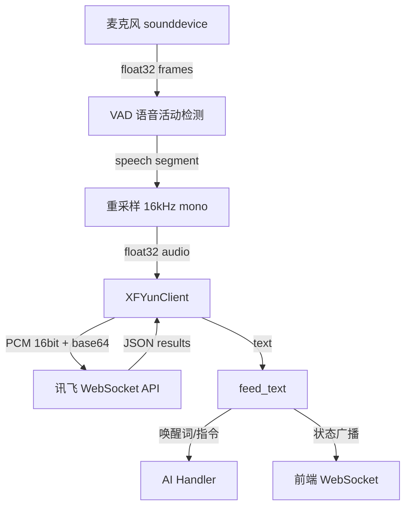

# Design Document: 讯飞在线 ASR 替换 faster-whisper

## Overview

将智能镜面语音助手的 ASR 引擎从本地 faster-whisper 模型替换为讯飞在线语音听写 WebSocket 实时流式接口。核心变更：

1. 新增 `XFYunClient` 类，封装讯飞 WebSocket 鉴权、音频帧发送、结果拼接
2. 修改 `ASRHandler`，将 `_transcribe` 方法从调用本地 Whisper 模型改为调用 `XFYunClient`
3. 移除 faster-whisper 相关配置和依赖
4. 新增讯飞配置项到 `Settings`

设计原则：最小化变更范围，仅替换语音转文字的底层实现，保留 VAD、麦克风采集、唤醒词检测等上层逻辑不变。

## Architecture



### 模块职责

| 模块 | 职责 |
|------|------|
| `asr_handler.py` | 麦克风采集、VAD、调度转写、唤醒词检测 |
| `xfyun_client.py` (新增) | 讯飞 WebSocket 鉴权连接、音频帧流式发送、结果接收拼接 |
| `config.py` | 讯飞配置项管理 |

### 数据流

1. `mic_loop` 通过 sounddevice 回调采集音频帧
2. VAD 检测到语音段后，拼接帧并重采样到 16kHz
3. 调用 `XFYunClient.transcribe(audio: np.ndarray) -> str`
4. `XFYunClient` 内部：建立 WebSocket 连接 → 分帧发送 → 接收结果 → 拼接文本 → 关闭连接
5. 返回文本交给 `feed_text` 处理

## Components and Interfaces

### XFYunClient

新增文件：`backend/app/xfyun_client.py`

```python
class XFYunClient:
    """讯飞在线语音听写 WebSocket 客户端"""

    def __init__(self, app_id: str, api_key: str, api_secret: str,
                 language: str = "zh_cn", domain: str = "iat"):
        ...

    def _build_auth_url(self) -> str:
        """构造 HMAC-SHA256 签名鉴权 URL"""
        ...

    async def transcribe(self, audio: np.ndarray) -> str:
        """
        将 float32 音频转写为文本。
        
        Args:
            audio: 16kHz mono float32 numpy array
            
        Returns:
            识别文本，失败返回空字符串
        """
        ...

    def _audio_to_pcm(self, audio: np.ndarray) -> bytes:
        """float32 [-1,1] → PCM 16-bit signed integer bytes"""
        ...

    def _split_frames(self, pcm: bytes, frame_size: int = 1280) -> list[bytes]:
        """将 PCM 数据按 1280 字节分帧"""
        ...

    def _parse_response(self, message: str) -> tuple[str, bool]:
        """
        解析讯飞响应 JSON。
        
        Returns:
            (text_segment, is_final)
        """
        ...
```

### ASRHandler 修改

```python
# 移除
def _load_model(self): ...

# 修改
async def _transcribe_xfyun(self, audio: np.ndarray) -> str:
    """调用讯飞在线 ASR 替代本地 Whisper"""
    from .xfyun_client import xfyun_client
    return await xfyun_client.transcribe(audio)
```

`mic_loop` 中将 `await asyncio.to_thread(self._transcribe, audio)` 替换为 `await self._transcribe_xfyun(audio)`。

### Config 修改

```python
# 新增讯飞配置项（替换 Whisper 相关项）
XFYUN_APPID: str = ""
XFYUN_API_KEY: str = ""
XFYUN_API_SECRET: str = ""
XFYUN_LANGUAGE: str = "zh_cn"
XFYUN_DOMAIN: str = "iat"
```

移除：`WHISPER_MODEL`, `WHISPER_COMPUTE`, `WHISPER_DEVICE`, `WHISPER_LANGUAGE`, `WHISPER_BEAM_SIZE`, `WHISPER_BEST_OF`, `WHISPER_NO_SPEECH_THR`

## Data Models

### 讯飞 WebSocket 请求帧格式

```json
{
  "common": {"app_id": "<APPID>"},
  "business": {
    "language": "zh_cn",
    "domain": "iat",
    "accent": "mandarin",
    "vad_eos": 3000
  },
  "data": {
    "status": 0,
    "format": "audio/L16;rate=16000",
    "encoding": "raw",
    "audio": "<base64 encoded PCM>"
  }
}
```

- `status`: 0=首帧（含 common+business+data），1=中间帧（仅 data），2=末帧（仅 data）
- 首帧必须包含 `common` 和 `business` 字段
- 中间帧和末帧只需 `data` 字段

### 讯飞 WebSocket 响应格式

```json
{
  "code": 0,
  "message": "success",
  "sid": "...",
  "data": {
    "status": 2,
    "result": {
      "sn": 1,
      "ls": false,
      "ws": [
        {"bg": 0, "cw": [{"w": "你好", "sc": 0}]},
        {"bg": 0, "cw": [{"w": "世界", "sc": 0}]}
      ]
    }
  }
}
```

- `data.status`: 0=首次结果, 1=中间结果, 2=最终结果
- 文本拼接：遍历 `data.result.ws[].cw[].w` 按序拼接

### 鉴权 URL 构造

```
签名原文 (signature_origin):
    host: iat-api.xfyun.cn
    date: <RFC1123 格式时间>
    GET /v2/iat HTTP/1.1

签名步骤:
    1. signature = HMAC-SHA256(api_secret, signature_origin)
    2. authorization = base64(f"api_key=\"{api_key}\", algorithm=\"hmac-sha256\", headers=\"host date request-line\", signature=\"{base64(signature)}\"")
    3. url = f"wss://iat-api.xfyun.cn/v2/iat?authorization={authorization}&date={date}&host=iat-api.xfyun.cn"
```


## Correctness Properties

*A property is a characteristic or behavior that should hold true across all valid executions of a system—essentially, a formal statement about what the system should do. Properties serve as the bridge between human-readable specifications and machine-verifiable correctness guarantees.*

### Property 1: Auth URL signature is verifiable

*For any* valid (app_id, api_key, api_secret) tuple and any timestamp, the authentication URL produced by `_build_auth_url` should contain a `signature` parameter that can be independently verified by recomputing HMAC-SHA256 over the same signature origin string with the same api_secret.

**Validates: Requirements 2.1**

### Property 2: First frame contains required protocol fields

*For any* valid configuration (app_id, language, domain), the JSON payload constructed for the first frame (status=0) should contain `common.app_id`, `business.language`, `business.domain`, and `data.status == 0`.

**Validates: Requirements 2.3**

### Property 3: Empty credentials guard

*For any* combination of (app_id, api_key, api_secret) where at least one value is an empty string, calling transcribe should return an empty string without attempting a WebSocket connection.

**Validates: Requirements 3.5**

### Property 4: Float32 to PCM int16 conversion

*For any* float32 numpy array with values in [-1.0, 1.0], `_audio_to_pcm` should produce a bytes object where each 2-byte little-endian signed integer equals `round(sample * 32767)` clamped to [-32768, 32767].

**Validates: Requirements 4.1**

### Property 5: PCM framing produces correct frame sizes

*For any* PCM byte array of length N, `_split_frames(pcm, 1280)` should produce `ceil(N / 1280)` frames where all frames except possibly the last have exactly 1280 bytes, and the concatenation of all frames equals the original PCM data.

**Validates: Requirements 4.2**

### Property 6: Frame status assignment follows protocol

*For any* list of frames with length >= 1, the status assignment should be: if only 1 frame → status=2; if multiple frames → first=0, middle frames=1, last=2. No frame should have a status outside {0, 1, 2}.

**Validates: Requirements 4.3**

### Property 7: Response parsing extracts and concatenates text correctly

*For any* valid iFlytek response JSON containing `data.result.ws[].cw[].w` fields, `_parse_response` should return the concatenation of all `w` values in document order.

**Validates: Requirements 5.1, 5.2**

### Property 8: Resample preserves duration

*For any* float32 mono audio array at source sample rate S (where S != 16000), after resampling to 16000 Hz, the output length should satisfy `abs(len(output) / 16000 - len(input) / S) < 1/16000` (within one sample of the expected duration).

**Validates: Requirements 6.5**

## Error Handling

| 场景 | 处理方式 |
|------|----------|
| 讯飞凭证为空 | 日志 warning，`transcribe` 返回 `""`，mic_loop 继续 |
| WebSocket 连接失败 | 捕获异常，日志 error，返回 `""`，不抛出 |
| WebSocket 超时 (>10s) | `asyncio.wait_for` 超时，关闭连接，返回 `""` |
| 讯飞返回非零 code | 日志 error（含 code + message），返回 `""` |
| 音频转换异常 | 捕获异常，日志 error，返回 `""` |
| 转写失败后 | 广播 `{"type": "asr_step", "step": "idle"}`，mic_loop 继续下一轮 |

所有错误处理遵循同一原则：**不中断 mic_loop，不抛出异常到上层，失败时返回空字符串并重置前端状态**。

## Testing Strategy

### 单元测试

使用 `pytest` 框架，重点覆盖：

- **XFYunClient._build_auth_url**: 验证签名结构正确性（固定时间戳 + 已知密钥 → 已知签名）
- **XFYunClient._audio_to_pcm**: 验证边界值转换（0.0, 1.0, -1.0, 0.5）
- **XFYunClient._split_frames**: 验证空数据、恰好整除、不整除的分帧
- **XFYunClient._parse_response**: 验证正常响应、错误响应、空结果
- **Config**: 验证默认值和环境变量注入
- **集成**: mock WebSocket 验证完整 transcribe 流程

### 属性测试

使用 `hypothesis` 库，每个属性测试运行至少 100 次迭代。

每个测试必须以注释标注对应的设计属性：

```python
# Feature: xfyun-online-asr, Property 1: Auth URL signature is verifiable
# Feature: xfyun-online-asr, Property 4: Float32 to PCM int16 conversion
# Feature: xfyun-online-asr, Property 5: PCM framing produces correct frame sizes
# Feature: xfyun-online-asr, Property 6: Frame status assignment follows protocol
# Feature: xfyun-online-asr, Property 7: Response parsing extracts and concatenates text correctly
# Feature: xfyun-online-asr, Property 8: Resample preserves duration
```

属性测试重点：
- Property 1: 生成随机 credentials + 时间戳，验证签名可逆验证
- Property 4: 生成随机 float32 数组（范围 [-1,1]），验证 PCM 转换正确性
- Property 5: 生成随机长度 bytes，验证分帧后拼接等于原始数据
- Property 6: 生成随机帧数量 (1-100)，验证 status 分配规则
- Property 7: 生成随机 ws/cw 结构，验证解析拼接正确
- Property 8: 生成随机长度音频 + 随机源采样率，验证输出时长一致

### 边界/边缘用例（单元测试覆盖）

- 空音频数组 → 返回空字符串
- 讯飞返回 code != 0 → 返回空字符串
- WebSocket 连接超时 → 返回空字符串
- 凭证部分为空 → 跳过转写
- 单帧音频（< 1280 字节）→ status 直接为 2
